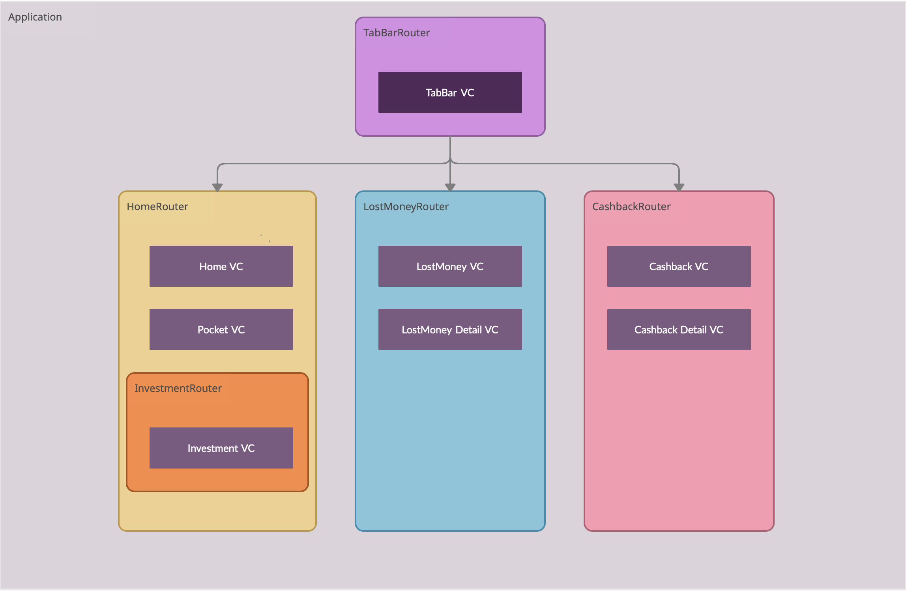

# ProjectMercury
A brief look at the Coordinator and Redux pattern with swift

## Overview
This project is to showcase how we can implement the coordinator pattern using routers. It includes 
- A `Router` protocol, that contains all the functions and properties needed to create a structural pattern for easily navigating around the app.
- An `AppPath` enum that has all the potentional screens needed by the routers for navigation.
- A `RouteData` for passing app-paths and route parameters around the app. 

## Why use a coordinator?

- We use this pattern to decouple view controllers from one another. The only component that knows about view controllers directly is the coordinator.
- It makes view controllers much more reusable. If you want to create a new flow within your app, you can simply create a new or sub coordinators/routers with all the necessary screens of that flow.
- It helps to easily manage and understand the app routing structure and its hierarchy.
- It will unify routing (e.g push, present, dismiss, pop) with deeplinks (e.g push notifications, url links), universal links and shortcuts.

## Example Flow

## Glossary

- 1) `Router`: This is the Coordinator where each route-node has a parent and potential children.
- 2) `NavigationRoutable`: This is an extension of the router which holds the Presenter object that is used to present and push  UIViewControllers.
- 3) `ChildRouter (i.e HomeRouter)`: Each class conforming to NavigationRoutable can be considered as a RouteNode, which implements its own dedicated setup and reset functions and contains a Presenter that delegates the navigation between the screens of a RouteNode.
- 4) `NavigationPresenter`: this is the Presenter object, which is the viewcontroller at the top level of each router, it embeds a navigation controller and is able to execute requests from their router to push, pop, present and dismiss UIViewControllers.
- 5) `weak var router: Router?`: all view controllers that need to talk to their coordinator/router will have this notation. For larger apps you’ll want to use the protocol `Router` here so that you can have the available properties and functions of the coordinator. 
- 6) `router.route(to:...`: all view controllers that need to communitcate with their coordinator/router to go to other screens will have this notation. The coordinator will handle these requests and show the appropriate screen depending of how the router is setup. 

## Useful Links
- [MonarchRouter Github repo](https://github.com/nikans/MonarchRouter).
- [Raywenderlich Coordinator Pattern](https://www.raywenderlich.com/books/design-patterns-by-tutorials/v3.0/chapters/23-coordinator-pattern).
- [Soroush Khanlou](https://khanlou.com/2015/01/the-coordinator/), one of the earlier blogs about coordinators
- [Paul Hudson - How to use the coordinator pattern in iOS apps](https://www.hackingwithswift.com/articles/71/how-to-use-the-coordinator-pattern-in-ios-apps)
